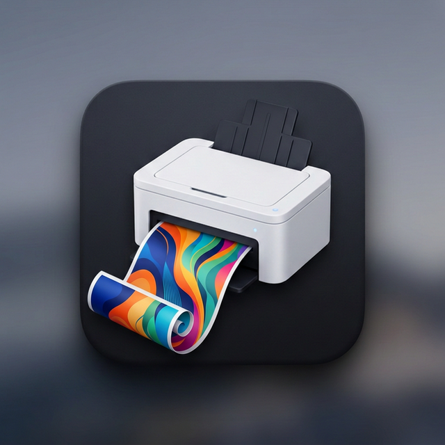

# Duplex Printer

<div align="center">
  
</div>
<br>

A simple, native macOS application built with SwiftUI to help you manually print duplex (double-sided) on printers that don't support it natively.

## Features

- **Drag and Drop**: Easily drop a PDF to print.
- **Odd Pages First**: Prints all odd pages sequentially.
- **Smart Even Pages**: After flipping the stack and putting it back in the tray, it prints the even pages in reverse order so they perfectly match the backs of the odd pages without needing to be restacked!
- **Odd Page Count Handling**: Automatically inserts a protective blank page to ensure the final even page isn't printed on the back of the last odd page for documents with an odd number of pages.

## How to Build

Run the included build script:

```bash
chmod +x build.sh
./build.sh
```

This will compile the Swift files and package them into `DuplexPrinter.app` in the same directory. You can then double-click the `.app` bundle to run it.

## License

This project is licensed under the MIT License - see the [LICENSE](LICENSE) file for details.
